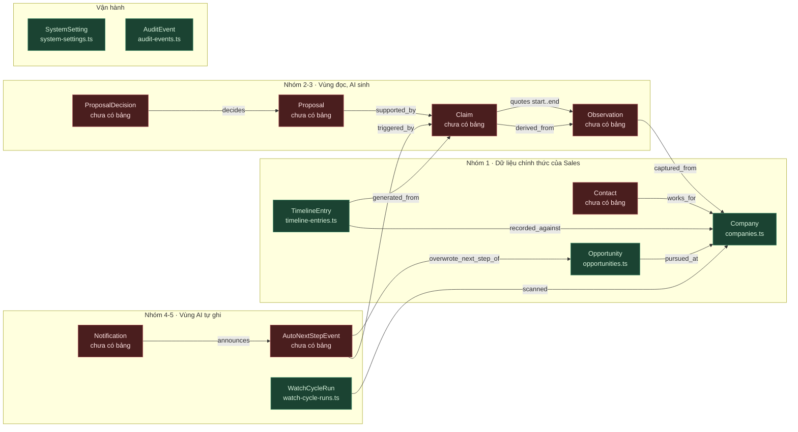

# Visual Explanation: Implement Ontology To Project

> Cách `docs/ontology.md` biến thành code chạy được — dựa trên trạng thái thật của repo lúc 12/08/2026 22:38.
> Nguồn: `docs/ontology.md`, `packages/contracts/src/enums.ts`, `packages/db/src/schema/*`, `packages/db/migrations/0001_grants.sql`.

## Overview

Ontology không phải file tham khảo. Nó là **nguồn sự thật về tên và ràng buộc**, và chỉ có giá trị khi code đọc được nó. Repo hiện đã dựng xong **xương sống lớp 1–2** (tên + enum + bảng) và **lớp 4** (quyền theo cột), còn **lớp 3** (chặn ở tầng domain) và 7 bảng của vùng AI thì chưa.

Cách cài ontology vào dự án = ép nó qua **4 lớp**, mỗi lớp chặn một kiểu sai khác nhau. Bỏ lớp nào thì ontology thành trang trí (CLAUDE.md mục 8).

## Quick View (ASCII) — chuỗi dẫn xuất đang chạy thật

```
   docs/ontology.md            §3.5 enum · §4 quan hệ có tên · §6 bất biến I-1..I-14
        │  (người sửa ở đây trước, luôn luôn)
        ▼
┌───────────────────────────────────────────────────────────────────────┐
│ LỚP 1 · TÊN     packages/contracts/src/enums.ts                       │
│   COMPANY_TYPE = { traditional: 'Traditional', ... }                  │
│   key = code (tiếng Anh)   ·   value = nhãn Sales đọc (tiếng Việt)    │
│   ENUMS = { company_type, stage, ... }  ← registry 12 enum            │
│        ▲                                                              │
│        └── __tests__/ontology-enum-parity.test.ts                     │
│            đọc chính docs/ontology.md → lệch một giá trị là ĐỎ        │
└───────────────────────────────────────────────────────────────────────┘
        │  enumCodes(COMPANY_TYPE) → ['traditional', ...]
        ▼
┌───────────────────────────────────────────────────────────────────────┐
│ LỚP 2 · KIỂU    packages/db/src/schema/enums.ts + các bảng            │
│   pgEnum('company_type', enumCodes(COMPANY_TYPE))                     │
│   KHÔNG gõ lại giá trị nào — 12 pgEnum sinh thẳng từ contracts        │
│   Quan hệ "nóng" §4 = khoá ngoại thật: references(() => companies.id) │
└───────────────────────────────────────────────────────────────────────┘
        │  pnpm db:generate
        ▼
┌───────────────────────────────────────────────────────────────────────┐
│ LỚP 3 · HÀNH VI   apps/api — tầng service  ◄── CHƯA CÓ                │
│   mọi đường ghi mang `actor`; actor=system chạm vùng cấm → ném lỗi    │
│   + ghi AuditEvent. Đây là nơi I-1..I-14 sống.                        │
└───────────────────────────────────────────────────────────────────────┘
        │
        ▼
┌───────────────────────────────────────────────────────────────────────┐
│ LỚP 4 · CSDL    packages/db/migrations/0001_grants.sql   ◄── ĐÃ CÓ    │
│   GRANT UPDATE (next_step_text, next_step_due_date, next_step_source) │
│        ON opportunities TO crm_system;     ← chỉ 3 cột, vùng 3        │
│   GRANT SELECT, INSERT ON timeline_entries TO crm_system;  ← vùng 4   │
│   (không có GRANT UPDATE stage/expected_value → vùng cấm chặn cứng)   │
└───────────────────────────────────────────────────────────────────────┘
```

**Điểm mấu chốt:** lớp 4 chặn được cả khi lệnh **không** đến từ giao diện — đúng yêu cầu CLAUDE.md mục 4. Lớp 3 một mình là "lời dặn dò suông".

## Detailed Flow — bản đồ thực thể: đã có gì, thiếu gì



Xanh = đã có bảng (7 bảng đang chạy trong Postgres). Đỏ = còn nợ (7 bảng).

Mỗi mũi tên là **một câu tiếng Việt đọc được** ở ontology §4 — đó là test nghiệm thu của chính ontology. Đặt được tên quan hệ thì mới viết được khoá ngoại đúng chiều.

## Key Concepts

### 1. Enum đi một chiều, không bao giờ gõ lại giá trị

`packages/db/src/schema/enums.ts` không chứa một chuỗi giá trị nào — nó gọi `enumCodes(COMPANY_TYPE)`. Sửa ontology mà quên contracts → parity test đỏ. Sửa contracts → migration kế tiếp sinh ra khác. Đây là lý do ontology không trôi khỏi code.

### 2. Quan hệ "nóng" là khoá ngoại, quan hệ suy luận là cột truy vết

Ontology §4 chốt sẵn: `works_for`, `pursued_at`, `derived_from` → FK thật. `generated_from`, `triggered_by` → cột `source_claim_id` để truy ngược. `timeline-entries.ts` hiện đã có `sourceClaimId` **chưa có FK**, kèm comment nói rõ phải gắn `references()` khi bảng `claims` ra đời. Đó là món nợ đã ghi biên nhận, không phải chỗ quên.

### 3. Provenance không phải bảng — là ràng buộc

Ontology §2 nói thẳng: `Provenance` không có bảng riêng. Nó sống ở hai chỗ:

- **I-1** `Claim` không có `quote_text` → từ chối lưu.
- **I-2** `quote_text` phải là chuỗi con **nguyên văn** của `Observation.raw_content`; `quote_start`/`quote_end` **do code tính**, không nhận từ LLM.

Port `packages/contracts/src/ports/claim-extractor.ts` đã cài sẵn luật này bằng cách **cố tình không có** trường offset trong `ClaimDraft` — LLM không có đường khai báo vị trí, nên không có đường bịa.

### 4. Bốn vùng tự chủ = bốn dòng GRANT khác nhau

| Vùng | Ontology §5 | Dòng GRANT tương ứng |
| --- | --- | --- |
| 1 · Tự do | tạo Observation, Claim | `GRANT SELECT, INSERT ON observations/claims` (chưa viết) |
| 2 · Chờ duyệt | sinh Proposal | `GRANT SELECT, INSERT ON proposals` (chưa viết) |
| 3 · Tự ghi, hoàn tác được | đặt Việc tiếp theo | `GRANT UPDATE (next_step_text, next_step_due_date, next_step_source) ON opportunities` ✅ |
| 4 · Tự ghi, không hỏi ai | thêm mục dòng thời gian | `GRANT SELECT, INSERT ON timeline_entries` ✅ (không DELETE — I-13) |
| ✋ Cấm | stage, expected_value, xoá | **không có dòng nào** → Postgres từ chối ✅ |

Vùng cấm được enforce bằng **sự vắng mặt** của GRANT, không bằng REVOKE. `0001_grants.sql` cảnh báo rõ: `GRANT UPDATE` mức bảng rồi `REVOKE` theo cột **chặn được số không**.

## Code Example — công thức thêm một thực thể ontology

Lấy `Claim` làm ví dụ. Bảy bước, đúng thứ tự, không đi tắt:

**Bước 1 — Enum đã có sẵn.** `signal_type`, `confidence`, `trigger_context` đã nằm trong `contracts/enums.ts` và đã là `pgEnum`. Không phải làm gì.

**Bước 2 — Viết bảng, mỗi cột soi ngược về một dòng ontology §2:**

```ts
// packages/db/src/schema/claims.ts
export const claims = pgTable('claims', {
  id: uuid('id').primaryKey().defaultRandom(),
  // ontology §3.2: Claim thuộc ĐÚNG MỘT Company, thừa kế từ Observation
  companyId: uuid('company_id').notNull().references(() => companies.id),
  // §4 `derived_from` — quan hệ nóng, khoá ngoại thật
  observationId: uuid('observation_id').notNull().references(() => observations.id),
  statement: text('statement').notNull(),
  signalType: signalTypeEnum('signal_type').notNull(),
  confidence: confidenceEnum('confidence').notNull(),
  // I-1: NOT NULL là lớp cuối. Chuỗi rỗng vẫn lọt → phải chặn thêm ở service (bước 4)
  quoteText: text('quote_text').notNull(),
  // I-2: code tính, không nhận từ LLM
  quoteStart: integer('quote_start').notNull(),
  quoteEnd: integer('quote_end').notNull(),
  // §3.5: quyết định claim này có được ghi vào timeline không (I-4)
  triggerContext: triggerContextEnum('trigger_context').notNull(),
  createdAt: timestamp('created_at', { withTimezone: true }).notNull().defaultNow(),
})
```

**Bước 3 — Nối lại món nợ FK đã ghi biên nhận:** `timeline-entries.ts` dòng 32, `sourceClaimId` thêm `.references(() => claims.id)`.

**Bước 4 — Chặn I-1 + I-2 ở tầng service, nơi duy nhất tính được offset:**

```ts
// apps/api — chỗ DUY NHẤT được phép ghi claim
function toClaimRow(draft: ClaimDraft, obs: ObservationInput) {
  // I-1: câu trích rỗng thì không có provenance → không có claim
  if (!draft.quoteText.trim()) throw new ProvenanceMissingError()
  // I-2: LLM paraphrase → indexOf trả -1 → từ chối cả claim.
  // Đây là lý do ClaimDraft không có trường offset: chỉ code được cấp con số này.
  const start = obs.rawContent.indexOf(draft.quoteText)
  if (start === -1) throw new QuoteNotVerbatimError()
  return { ...draft, quoteStart: start, quoteEnd: start + draft.quoteText.length }
}
```

**Bước 5 — Thêm GRANT vào cuối `0001_grants.sql`** (file đã dặn sẵn chỗ này):

```sql
GRANT SELECT, INSERT ON claims TO crm_system;   -- vùng 1: sinh tự do
-- không UPDATE, không DELETE: claim đã sinh là bằng chứng, không sửa lại được
```

**Bước 6 — Test cho bất biến.** Không có test = coi như chưa làm (ontology §6). Tối thiểu: câu trích rỗng bị từ chối (I-1), câu trích paraphrase bị từ chối (I-2), claim `manual_ingest` không sinh timeline (I-4).

**Bước 7 — `pnpm db:generate` → `pnpm db:migrate`.** Không dùng `db:push` (xoá GRANT theo cột).

## Bất biến → nơi enforce

| Bất biến | Chặn ở đâu | Trạng thái |
| --- | --- | --- |
| I-1, I-2 câu trích nguyên văn | service (`indexOf`) + `NOT NULL` | port đã sẵn, service chưa |
| I-3 chỉ tạo Observation khi hash khác | service vòng quét + unique trên `content_hash` | chưa |
| I-4 `manual_ingest` không sinh timeline | service | chưa |
| I-5, I-6, I-7, I-8, I-9 | service | chưa |
| I-10 bỏ nhịp khi vòng quét chồng | worker + `skipped_reason` | bảng đã có |
| I-11 whitelist ô được sửa | service + GRANT theo cột trên `companies` | chưa |
| I-12 `edit` không cộng vào `accept` | truy vấn chỉ số | chưa |
| I-13 xoá mục hệ thống phải có lý do | service + **không GRANT DELETE** | GRANT ✅ |
| Vùng cấm (stage, expected_value, xoá) | **hai lớp**: service + vắng GRANT | GRANT ✅, service chưa |

## Nợ kỹ thuật đang mở (từ ontology §10 + câu hỏi cuối file)

- [ ] Ontology **chưa có người ngoài người viết duyệt** — DoD mục 5 CLAUDE.md bắt buộc.
- [ ] `USER_ROLE` (sales/admin) nằm trong code nhưng **không** có trong ontology §3.5 — contracts đã ghi chú thẳng đây là lỗ hổng của ontology, chưa vá.
- [ ] `Contact` có trong ontology §3.1 nhưng chưa có bảng; `timeline_entries.contact_id` đang treo không FK.
- [ ] Bản chụp là HTML hay text → quyết định `quote_start`/`quote_end` đếm offset trên chuỗi nào (I-2 phụ thuộc trực tiếp).

## Câu hỏi chưa giải quyết

1. Thứ tự làm 7 bảng còn thiếu: đi theo luồng dữ liệu (Observation → Claim → Proposal → Decision) hay đi theo màn hình demo (hàng đợi duyệt trước)?
2. `Contact` có nằm trong phạm vi demo vòng 1 không, hay để nguyên `contact_id` không FK tới sau hackathon?
3. `source_tier` (tháp tin cậy 1–6) hiện luôn là "website công ty" — giữ chỗ hay bỏ khỏi bảng `observations` sắp viết?
